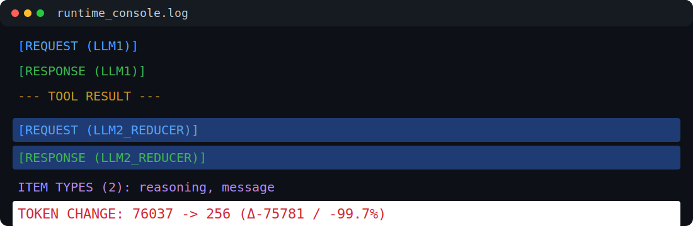

# LLM Agent for Large-Scale Data Processing on Models with Limited Context

> Experimental orchestration framework exploring how LLM agents can process datasets significantly larger than the model context window using iterative retrieval and semantic reduction.


# 🧠 Motivation

Modern LLMs are powerful reasoning systems, but they are still limited by:

- finite context window
- expensive token usage
- limited reliability when processing large datasets
- inability to safely paginate external APIs autonomously

In real-world environments, external systems often return:

- thousands of records
- large JSON structures
- verbose logs
- ticket histories
- monitoring data
- enterprise API payloads

These datasets frequently exceed the context capacity of the model.

The goal of this project is to explore an architecture that allows an LLM agent to:

- work with large-scale external data
- iteratively load and process data
- semantically reduce tool outputs
- preserve only relevant information
- continue reasoning within limited context budgets


# Main Idea

The project separates the system into multiple specialized layers:

| Component                        | Responsibility                                     | Implementation |
| -------------------------------- | -------------------------------------------------- | -------------- |
| LLM1 (Main Agent / Orchestrator) | reasoning, planning, tool selection                | `agent.py`     |
| Tool Adapter                     | OpenAPI tool generation, API execution, transport layer  | `adapters/openapi_adapter.py`   |
| LLM2 (Reducer)                   | semantic reduction and aggregation                 | `reducer.py`   |

Instead of allowing the main model to directly process extremely large datasets, the architecture:

1. loads data iteratively
2. processes them in chunks
3. semantically compresses results
4. injects only reduced outputs back into the agent context


# Architecture Overview


Core concepts:

- separation of orchestration and reduction
- adapter-based tool provider abstraction
- adaptive pagination
- chunk-based processing
- semantic reduction pipeline
- OpenAPI-driven tool generation
- short-term vs long-term memory separation


# 📋 Key Features

## OpenAPI Tool Generation

The framework dynamically parses `openapi.json` and generates:

- tool schemas for the LLM
- internal executor metadata

This allows external APIs to be integrated with minimal changes.

The framework intentionally separates:

- LLM-facing tool schemas
- internal executor orchestration metadata

Pagination-related parameters such as `offset` and `limit` are intentionally removed from the tool schemas exposed to the LLM.

This prevents the model from attempting autonomous pagination during reasoning, because pagination orchestration is handled exclusively by the executor layer.

Relying only on SYSTEM_PROMPT instructions for pagination control was found to be insufficiently reliable in experimental runs.


## ⚙️ Internal Pagination Handling

The LLM itself is intentionally isolated from pagination logic.

Pagination logic is handled internally by the executor layer:

- metadata retrieval (`meta_only`)
- token estimation
- adaptive chunk sizing
- iterative API calls
- chunk orchestration

This significantly improves reliability compared to prompt-based pagination.


## 🧩 Semantic Data Reduction

Large tool outputs are processed by a secondary LLM reducer.

The reducer:

- removes irrelevant data
- preserves linking identifiers
- compresses verbose structures
- aggregates repeated information
- minimizes context growth

*Reduction may be skipped for smaller payloads where orchestration overhead would exceed reduction benefits.*

This enables multi-step reasoning over datasets that would otherwise exceed model limits.


## 📦 Context Management

The project distinguishes between:

### Short-Term Memory

Working memory used during orchestration:

- user messages
- tool calls
- tool outputs
- intermediate reasoning

### Long-Term Memory

Persistent conversation history:

- user queries
- final assistant answers

This prevents uncontrolled context growth.


# 🗂️ Project Structure

```text
/
├── adapters/
│   └── openapi_adapter.py           # OpenAPI tool adapter abstraction
│
├── agent.py                         # Main orchestration agent
├── misc.py                          # Shared helper functions
├── mock_api.py                      # Mock OpenAPI server
├── reducer.py                       # Semantic reducer (LLM2)
│
├── mockdata/                        # Large mock datasets
│   ├── customer4_anonymized.json
│   └── ...
│
├── logs/
│   └── debug_*.log                  # Runtime logs
│
├── docs/
│   ├── architecture_v3.png          # Architecture diagram in PNG format
│   └── architecture_v3.svg          # Architecture diagram in SVG format
│
├── .env                             # Runtime configuration
├── requirements.txt
└── README.md
```


# 🔄 Workflow

## 1. User Query

The user sends a query to the orchestrator.

Examples:

```text
user_query> Zjisti vše o uživateli Baláž.
```
```text
user_query> Zjisti vše o uživateli Králová.
```

## 2. Tool Selection

LLM1 decides whether external data are required.

The model receives:

- dynamically generated tools
- tool descriptions
- parameter schemas


## 3. Metadata Retrieval

If the endpoint supports pagination (typically via `offset` and `limit` parameters), it is also expected to support lightweight metadata-only requests.

Example:

```text
GET /tickets?meta_only=true
```

The metadata response is used for orchestration planning before full retrieval begins.

The metadata typically includes:

- estimated token size
- total item count
- path to paginated payload data

Expected metadata structure:

```python
{
  "customer_id": customer_id,
  "data_path": "tickets",  # path to paginated data within the response, supports dot notation, e.g. "items.tickets"
  "tokens_estimation": tokens_estimation,
  "total_items": total
}
```


## 4. Adaptive Chunking

The executor calculates:

- average tokens per item
- optimal chunk/page size
- estimated number of pages (API calls)
- effective context utilization


## 5. Iterative Data Loading

The executor retrieves data in pages:

```text
GET /tickets?offset=0&limit=29
GET /tickets?offset=29&limit=29
GET /tickets?offset=58&limit=29
...
```


## 6. Semantic Reduction

Each chunk is processed by the reducer model.

Reducer responsibilities:

- semantic filtering
- summarization
- aggregation
- removal of irrelevant payload data
- reduction of context saturation
- mitigation of attention dilution effects

The reduction pipeline helps preserve relevant information density while minimizing unnecessary token usage.

This is important because modern LLMs operate with a finite context window, and using the entire available context is not always optimal.

Large prompts may suffer from:

- attention dilution
- lost-in-the-middle effects
- degraded reasoning quality
- higher latency
- increased token costs

For this reason, the framework distinguishes between:

| Parameter | Description |
|---|---|
| `LLM_MAX_CONTEXT` | Maximum context size supported by the model |
| `LLM_CONTEXT_UTILIZATION` | Intentionally allowed fraction of usable context |

Example:

```env
LLM_MAX_CONTEXT=128000
LLM_CONTEXT_UTILIZATION=0.25
```

In this configuration, the orchestration layer targets approximately 32k effective context usage, despite the model supporting 128k tokens.


## 7. Final Aggregation

Reduced chunk outputs are merged and injected back into the orchestrator context.

The main agent then continues reasoning using compressed information.


# 📉 Example Reduction Statistics

The following values are approximate examples from experimental runs.

| Dataset | Original Tokens | Reduced Tokens | Reduction |
|---|---:|---:|---:|
| Large ticket dataset | 355,000 | 18,000 | 94.9% |
| Customer communication history | 120,000 | 9,500 | 92.1% |
| Monitoring logs | 210,000 | 14,000 | 93.3% |

The actual reduction ratio depends on:

- dataset structure
- user query specificity
- reducer prompt quality
- aggregation strategy


# 🎨 Colored Runtime Console Logging

The framework provides structured colorized console logging designed for runtime tracing, orchestration debugging, and reducer inspection.

The logging system visually distinguishes individual orchestration stages and data flows, making complex LLM interactions significantly easier to analyze in real time.

## Console Color Categories

| Color | Meaning |
|---|---|
| Blue text | REQUEST sent to the main LLM |
| Green text | RESPONSE received from the main LLM |
| Yellow text | Tool execution results |
| Blue/green text on blue background | Reducer LLM requests and responses |
| Purple text | Response structure and item types |
| Red text on white background | Token statistics, reductions, context usage |

### Example Console Visualization



The image above demonstrates the approximate runtime appearance of the logging system.


# 🔍 Logging

The project includes runtime logging for:

- selected tools
- API calls
- pagination
- chunk processing
- token reduction statistics
- reducer activity
- error handling

Example log output:

```text
[agent] LLM TOOL SELECTED: get_tickets, [ARGS: {'customer_id': 4}]
[agent] API end-point supports metadata & pagination
[agent] API CALL: GET http://127.0.0.1:9001/tickets?customer_id=4&meta_only=True
[agent] [META] total_items=261 total_tokens_est=355116
[agent] [STRATEGY] PAGING ACTIVATED
[agent] [CHUNKING] one chunk budget=32768 tokens
[agent] [CHUNKING] avg_tokens_per_item=1117.10
[agent] [CHUNKING] items count in one chunk: limit=29
[agent] [CHUNKING] total pages: 9
[agent] API CALL: GET http://127.0.0.1:9001/tickets?customer_id=4&offset=0&limit=29
[agent] [PAGE 1/9] offset=0 limit=items=29
[agent] [PAGE 1/9] context reduction -> transformation function (summarization/agregation/selection/...)
...
[reducer] [REDUCER] preview={"meta": {"strategy": "aggregation", "notes": "Aggregated key information about the customer ...
[reducer] TOKEN CHANGE: 38402 -> 971 (Δ-37431 / -97.5%)
...
[agent] [PAGE 2/9] offset=29 limit=items=29
...
```


# ⚠️ Current Limitations

This project is currently experimental.

Known limitations:

- reducer outputs are not fully deterministic
- token estimation is heuristic
- no recursive reduction strategy yet
- no retry orchestration layer
- structured output reliability depends on model behavior
- context overflow handling is still evolving
- complex multi-question prompts may require future query decomposition/planning stages[^1]

[^1]: *Currently, if a single query contains multiple independent questions (e.g., about two different users), the orchestrator processes them sequentially within the same prompt.
Due to chunking, retrieval, and reduction, the model typically produces a correct answer only for the first question, while subsequent questions may be ignored or incomplete.  
A dedicated planning/decomposition stage could split such queries into independent subqueries, assign them to the retrieval/reduction pipeline, and aggregate results reliably.*

# 🚀 Future Work

Planned improvements:

- orchestrator/reducer prompt strategy improvements
- MCP adapter implementation
- distributed processing
- recursive reduction pipelines
- adaptive reduction strategies
- structured output enforcement
- streaming chunk processing

## Distributed Processing Potential

The paging/chunking architecture also enables future parallel and distributed processing.

Because segments are processed independently, reducer tasks may be delegated to multiple models or hardware nodes concurrently.

This may significantly reduce end-to-end processing latency and improve horizontal scalability.


# 🔧 Requirements

- Python 3.10+
- OpenAI-compatible Responses API
- FastAPI
- Uvicorn


# Running the Mock API

```bash
uvicorn mock_api:app --port 9001 --reload
```


# Running the Agent

```bash
python agent.py
```


# Environment Variables

Example `.env`:

```env
LLM_API_BASE_URL=http://127.0.0.1:9001/v1
LLM_API_KEY=dummy
LLM_NAME=gpt-4.1-mini
LLM_MAX_CONTEXT=131072
LLM_CONTEXT_UTILIZATION=0.25
LLM_TEMPERATURE=0.0
LLM_TOP_P=1.0
LLM_TIMEOUT=60
```


# 🧪 Research Goal

This project explores whether LLM agents can reliably operate over datasets that significantly exceed their native context window by combining:

- iterative retrieval
- semantic compression
- orchestration loops
- adaptive chunking
- external tool integration

The project focuses primarily on:

- orchestration reliability
- context preservation
- scalable tool usage
- semantic reduction strategies

rather than traditional chatbot interaction.


# Status

Current status:

- ✅ architecture prototype implemented
- ✅ OpenAPI adapter abstraction implemented
- ✅ adaptive pagination functional
- ✅ reducer pipeline functional
- ⚠️ semantic chunk reduction experimental


# License

Experimental / educational project.

